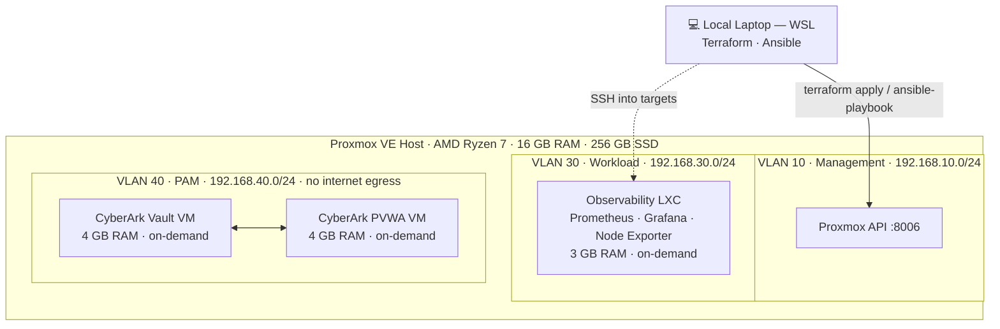

# homelab-infra

Infrastructure-as-Code for a self-hosted Proxmox homelab. Every environment in this repo is provisioned with Terraform and configured with Ansible — reproducible, version-controlled, and destroyed cleanly when not in use.

## Network Overview



## Projects

| Project | Type | RAM | Status |
|---------|------|-----|--------|
| [Observability stack](docs/ARCHITECTURE.md#observability) | LXC | 3 GB | In progress |
| [CyberArk PAM lab](docs/CYBERARK.md) | VM | 8 GB | Planned |

Environments are mutually exclusive — one runs at a time. See [switching environments](docs/TERRAFORM.md#switching-environments).

## Tech Stack

| Layer | Tool |
|-------|------|
| Hypervisor | Proxmox VE |
| IaC | Terraform · bpg/proxmox provider |
| Configuration management | Ansible |
| CI (validate + plan) | GitHub Actions |
| OS (containers) | Debian 12 |
| OS (CyberArk VMs) | Windows Server 2022 |

## Prerequisites

- Proxmox VE installed and reachable on your local network
- WSL (Ubuntu) with Terraform and Ansible installed
- A Proxmox API token (see [bootstrap guide](scripts/bootstrap.sh))
- Debian 12 LXC template downloaded on the Proxmox host

## Quick Start

```bash
# 1. Clone
git clone https://github.com/your-username/homelab-infra.git
cd homelab-infra

# 2. Copy and fill in your values
cp envs/observability.tfvars.example envs/observability.tfvars

# 3. Initialise Terraform
terraform init

# 4. Preview what will be created
terraform plan -var-file="envs/observability.tfvars"

# 5. Apply
terraform apply -var-file="envs/observability.tfvars"

# 6. Run Ansible against the new container
cp ansible/inventory/hosts.yml.example ansible/inventory/hosts.yml
# edit hosts.yml with the IP assigned by Proxmox
ansible-playbook -i ansible/inventory/hosts.yml ansible/playbooks/observability.yml
```

## Switching Environments

```bash
# Tear down current environment
terraform destroy -var-file="envs/observability.tfvars"

# Bring up a different one
terraform apply -var-file="envs/cyberark.tfvars"
```

Full details in [docs/TERRAFORM.md](docs/TERRAFORM.md).

## Documentation

- [Architecture overview](docs/ARCHITECTURE.md)
- [Network design](docs/NETWORK.md)
- [Terraform guide](docs/TERRAFORM.md)
- [Ansible guide](docs/ANSIBLE.md)
- [CyberArk lab](docs/CYBERARK.md)

## License

[MIT](LICENSE)
