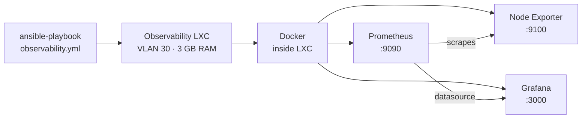
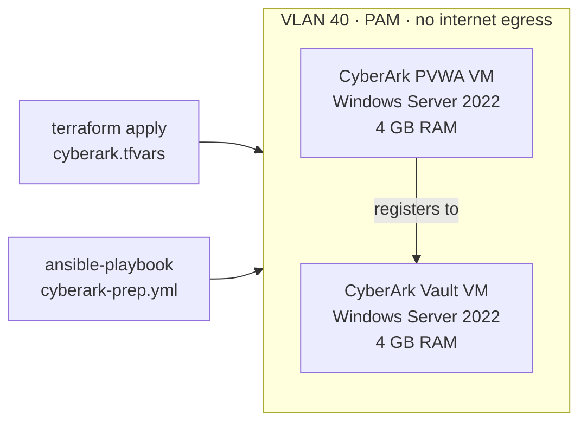
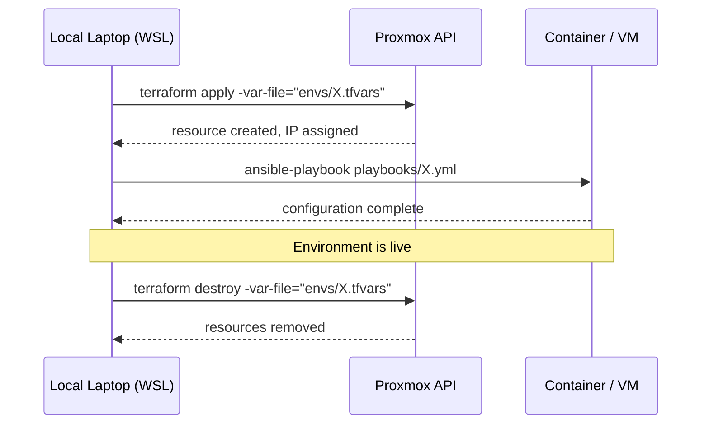

# Architecture

## Overview

This homelab runs on a single Proxmox VE host. All environments are provisioned on-demand using Terraform and configured using Ansible from a local laptop running WSL. Nothing is always-on except the Proxmox host itself.

The design follows one rule: **every environment must be fully reproducible from code**. If a container or VM is destroyed, running `terraform apply` followed by the matching Ansible playbook must return it to the exact same state.

## Host Hardware

| Component | Spec |
|-----------|------|
| CPU | AMD Ryzen 7 (8 cores / 16 threads) |
| RAM | 16 GB |
| Storage | 256 GB SSD SATA |
| Hypervisor | Proxmox VE |

## Environments

### Observability

A privileged LXC container running Prometheus, Grafana, and Node Exporter inside Docker. Used to practice containerised monitoring stack deployment and Ansible role composition.

**Resources:** 3 GB RAM · 2 vCPU · 30 GB disk · VLAN 30

### CyberArk PAM Lab

Two Windows Server 2022 VMs on an isolated VLAN 40 with no internet egress. Used to study CyberArk Privileged Access Management and prepare for the CyberArk Defender certification.

**Resources:** 8 GB RAM total · 4 vCPU total · 120 GB disk total · VLAN 40

## Deployment Flow

## Design Decisions

**LXC containers for Linux workloads, VMs for CyberArk.**
LXC containers share the host kernel — they boot faster and use 1–2 GB less RAM than full VMs running the same workload. CyberArk components require a full VM because they depend on kernel-level features and a full Windows environment.

**Privileged LXC for the observability container.**
Running Docker inside an LXC container requires the container to be privileged — this gives it the permissions needed to manage its own network namespaces. On a production system this would be a security concern; in a homelab it is an acceptable trade-off.

**No always-on containers.**
The 16 GB RAM constraint means running two environments simultaneously is tight. Keeping the baseline at just the Proxmox host OS (~2 GB) ensures each environment gets what it needs.

**VLAN 40 has no internet egress.**
CyberArk's Vault is designed to sit in an isolated network segment with no direct internet access. Replicating this in the lab mirrors real production architecture and is a core concept tested in the CyberArk Defender exam.

**Apply is always local.**
`terraform apply` runs from WSL on the local laptop, not from CI. GitHub Actions handles validation and planning only. This is documented in [TERRAFORM.md](TERRAFORM.md#apply-workflow).
