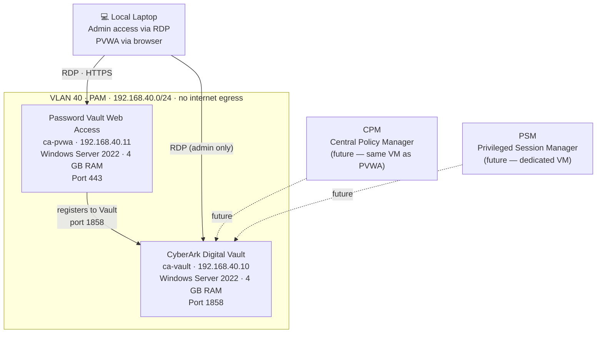

# CyberArk PAM Lab

## Purpose

This environment deploys a CyberArk Privileged Access Management lab on two isolated Windows Server 2022 VMs. It serves two goals:

1. Demonstrate real PAM infrastructure deployment in the portfolio
2. Prepare for the **CyberArk Defender** certification exam

## Component Architecture

## CyberArk Component Overview

Understanding what each component does is core Defender exam knowledge.

| Component | Role | Where it runs |
|-----------|------|---------------|
| **Vault** | Encrypted credential store — the core. All other components register to it. | Dedicated Windows Server VM |
| **PVWA** | Web interface for operators. Used to onboard accounts, manage Safes, launch sessions, view reports. | Windows Server (IIS) |
| **CPM** | Automatically rotates passwords on target systems. Checks out credentials, changes them, verifies the change. | Windows Server (service) |
| **PSM** | Acts as a jump server — RDP and SSH sessions proxy through it. Records sessions as video stored in the Vault. | Windows Server |
| **PSMP** | Same as PSM but for SSH specifically — Linux-based proxy. | Linux server |
| **PTA** | Privileged Threat Analytics. Detects anomalous privileged activity. | Separate appliance |
| **AAM** | Application Access Manager. Eliminates hardcoded credentials in applications. | Various |

**MVP lab (this repo):** Vault + PVWA only. This covers account onboarding, Safe management, and policy configuration — enough for the Defender exam core topics.

## Key Concepts for the Defender Exam

### The Vault

The Vault is a hardened Windows service that stores credentials in an encrypted database. It communicates on **port 1858**. No component except the Vault itself should have a direct database connection — everything goes through the Vault service.

The Vault has two special built-in accounts:
- **Administrator** — full access, used for initial setup
- **Auditor** — read-only access for compliance reviews

### Safes

A **Safe** is the fundamental unit of access control in CyberArk. Think of it as a folder that holds accounts (credentials). Access is controlled at the Safe level — you grant a user or a role permission to a Safe, not to individual accounts.

Safe permissions include:
- **List accounts** — see that accounts exist
- **Retrieve accounts** — view or use the credential
- **Add accounts** — onboard new credentials to the Safe
- **Update account properties** — modify metadata
- **Initiate CPM change** — trigger a password rotation
- **Manage Safe** — change the Safe's own access rules

### Master Policy

The Master Policy is the global policy that applies to all Safes unless a Safe-level exception is configured. It controls:

- **Require dual control** — password retrieval needs a second approver
- **Enforce check-in / check-out** — only one user can hold a credential at a time
- **One-time password** — CPM rotates the password immediately after it is used
- **Require reason** — user must state a reason before retrieving a credential
- **Allow transparent connections** — PSM can connect without showing the password to the user

Safes can override the Master Policy with stricter or looser rules for specific accounts.

### Account Onboarding

Onboarding means adding a privileged account (e.g. a root password, a service account) into a Safe. The CPM then takes ownership of rotating that password on the target system.

Onboarding steps:
1. In PVWA → Accounts → Add Account
2. Choose the target platform (e.g. `UnixSSH`, `WinDomain`, `Oracle`)
3. Enter the address, username, and current password
4. Select the Safe it belongs to
5. CPM verifies connectivity to the target and takes over the password

### Session Recording (PSM)

When a session is launched through PSM:
1. The user clicks "Connect" in PVWA — they never see the password
2. PSM retrieves the credential from the Vault
3. PSM opens the RDP or SSH session to the target on the user's behalf
4. The session is recorded as a video file and stored back in the Vault
5. When the session ends, CPM rotates the password (if One-Time Password is enabled)

The recording can be played back in PVWA by auditors. Every keystroke and screen action is captured.

### Dual Control

When Dual Control is enabled on a Safe, a user requesting a credential must receive approval from a designated approver before the Vault releases it. The request and approval are logged. This is used for the highest-sensitivity accounts (production database roots, domain admin, etc.).

## Install Sequence

### Prerequisites (both VMs)

Run `ansible-playbook ansible/playbooks/cyberark-prep.yml` after provisioning. This playbook:
- Sets Windows hostname
- Disables Windows Firewall (lab only — re-enable and configure for production)
- Installs .NET Framework 4.8
- Installs IIS with required features (PVWA VM only)
- Sets static IP (already done by Terraform)

### Phase 1 — Vault (ca-vault)

1. RDP into ca-vault (192.168.40.10)
2. Run the CyberArk Vault installer
3. Set the Vault Administrator password — store this securely
4. Note the Vault encryption keys generated during install — back these up immediately
5. Verify the Vault service is running: `services.msc` → `CyberArk Vault`
6. Verify port 1858 is listening: `netstat -an | findstr 1858`

### Phase 2 — PVWA (ca-pvwa)

1. RDP into ca-pvwa (192.168.40.11)
2. Run the PVWA installer
3. When prompted for the Vault address: `192.168.40.10`
4. The installer registers PVWA to the Vault over port 1858
5. Open a browser on the local laptop → `https://192.168.40.11/PasswordVault`
6. Log in with the Vault Administrator credentials

### Verify

- PVWA login page loads in the browser
- Vault dashboard shows PVWA as a connected component
- Create a test Safe and add a dummy account — confirms the full write path works

## Lab Limitations vs Production

| Aspect | This lab | Production |
|--------|----------|------------|
| Vault HA | Single VM | Two Vault nodes with DR Vault |
| Network | Isolated VLAN, no egress | Dedicated PAM network segment, HSM integration |
| Windows Firewall | Disabled for simplicity | Configured with precise rules per component |
| TLS certificates | Self-signed | Signed by internal CA |
| Backup | None configured | Vault backup to secure offline media |
| CPM | Not deployed | Deployed, rotating all managed accounts |

These limitations are expected in a study lab and are worth mentioning in an interview — it shows you understand what the production architecture looks like beyond the minimum.

## Defender Exam Topic Checklist

- [ ] Name all CyberArk PAM components and their roles
- [ ] Explain what a Safe is and how permissions work
- [ ] Describe the Master Policy and what each setting does
- [ ] Walk through account onboarding end to end
- [ ] Explain how PSM session recording works
- [ ] Explain Dual Control and when it would be used
- [ ] Explain One-Time Password mode
- [ ] Describe the Vault's port (1858) and what connects to it
- [ ] Explain why the Vault is on an isolated network segment
- [ ] Describe what CPM does when it rotates a password
