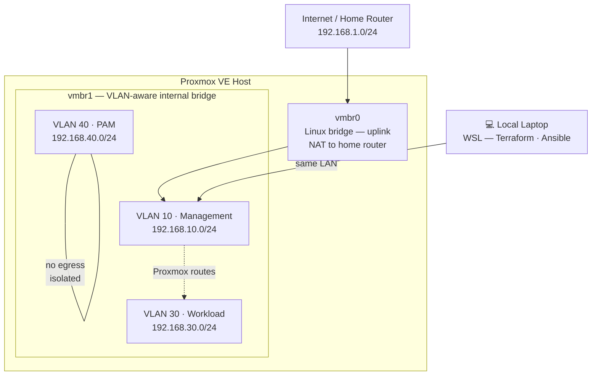

# Network Design

## Topology



## VLANs

| VLAN | Name | Subnet | Gateway | Purpose |
|------|------|--------|---------|---------|
| 10 | Management | 192.168.10.0/24 | 192.168.10.1 | Proxmox web UI (:8006), API, SSH access from laptop |
| 30 | Workload | 192.168.30.0/24 | 192.168.30.1 | On-demand project containers (Observability, etc.) |
| 40 | PAM | 192.168.40.0/24 | — | CyberArk VMs — no default gateway, no internet egress |

## Proxmox Bridge Configuration

Proxmox uses Linux bridges to connect VMs and containers to the network. This homelab uses two:

**`vmbr0` — external bridge**
Connects the Proxmox host to the home router. The host's physical NIC is attached here. Proxmox itself gets its management IP on this bridge.

**`vmbr1` — internal VLAN-aware bridge**
No physical NIC is attached. This bridge carries VLAN-tagged traffic between containers and VMs on the host. Each container or VM is assigned a VLAN tag — Proxmox strips the tag and delivers the frame to the right segment.

This separation means project workloads never share a bridge with the Proxmox management interface. If a container is misconfigured, it cannot interfere with Proxmox itself.

## IP Addressing

Static IPs are assigned via Terraform when each environment is provisioned. There is no DHCP inside the homelab — every address is declared in the `.tfvars` file for that environment.

```
VLAN 10 — Management
  192.168.10.1    Proxmox host (management interface)

VLAN 30 — Workload
  192.168.30.10   Observability LXC (when active)

VLAN 40 — PAM
  192.168.40.10   CyberArk Vault VM (when active)
  192.168.40.11   CyberArk PVWA VM (when active)
```

## VLAN 40 Isolation

VLAN 40 has no default gateway configured. This means:

- VMs on VLAN 40 cannot initiate outbound connections to the internet
- VMs on VLAN 40 cannot reach VLAN 30 or VLAN 10 unless a route is explicitly added
- The only way in is from the local laptop via a direct route, or via the Proxmox host acting as a jump point

This mirrors how a real CyberArk Vault network segment is designed. The Vault should never have internet access — it is the most sensitive component in a PAM architecture.

## How the Laptop Reaches VLAN 30 and VLAN 40

The laptop sits on the home LAN (`192.168.1.0/24`). To reach containers on VLAN 30 and VMs on VLAN 40, a static route is added on the laptop pointing to the Proxmox host as the gateway:

```bash
# Add in WSL — replace 192.168.1.X with your Proxmox host IP
sudo ip route add 192.168.30.0/24 via 192.168.1.X
sudo ip route add 192.168.40.0/24 via 192.168.1.X
```

The Proxmox host forwards the packets to the correct VLAN bridge. This routing is not persistent across WSL restarts — add it to your WSL session startup or document it as a manual step.

## Terraform and the Network Module

The bridges and VLAN assignments are defined in `modules/network/`. This module is applied once during initial setup and is never destroyed — bridges are infrastructure-level resources that all environments depend on.

See [TERRAFORM.md](TERRAFORM.md) for details on how the network module fits into the overall apply workflow.
